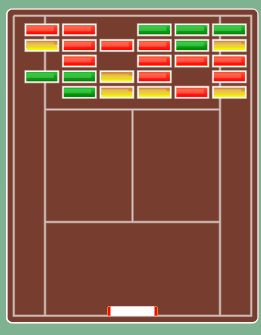

# Breakout clone - Tennis
A Breakout (a.k.a. Arkanoid) clone made from scratch with a tennis theme.

[Play the game on Heroku](https://breakoutclone.herokuapp.com/)

## Main functionality
- [x]  Breaking blocks
- [x]  Paddle movement
- [x]  Ball movement
- [x]  Collision

The **goal** of the game is to clear all the blocks. Blocks have different strengths (red -> yellow -> green)

## Requirements
- [x] Flexible code
- [x]  First logic, then design
- [x]  Randomness
- [x]  Sound

## Still to do
- [ ] Collide ball with other ball(s)
- [ ] High scores

